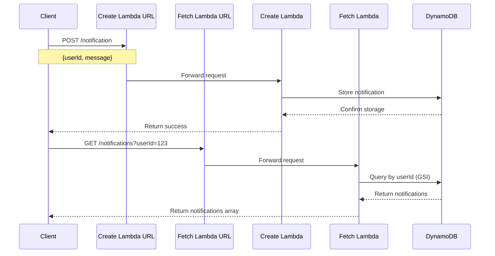
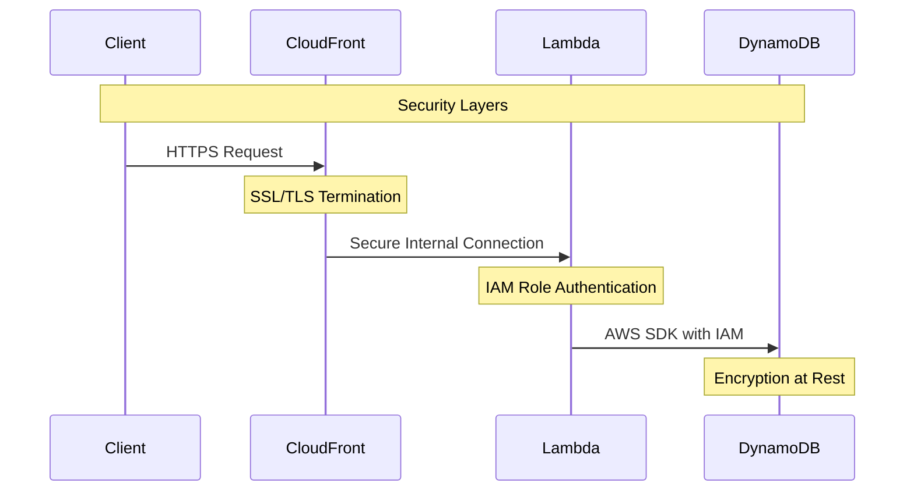

# AWS Serverless Notification Service

A PoC demonstratng a serverless notification system built with AWS CDK. This service enables you to easily add notification capabilities to your applications using AWS serverless architecture.

## System Flow



## Architecture

The service utilizes these AWS components:
- **DynamoDB**: Stores notification data with GSI for efficient querying
- **Lambda Functions**: Handles notification creation and retrieval
- **Lambda Function URLs**: Provides HTTP endpoints for the service

## Business Benefits

1. **Cost Efficiency**: 
   - Pay-per-use pricing model
   - No infrastructure management overhead
   - Automatic scaling based on demand

2. **Scalability**:
   - Handles millions of notifications
   - Auto-scales with traffic
   - No capacity planning needed

3. **Flexibility**:
   - Easy integration with any frontend
   - Extensible for additional features
   - Support for real-time notifications (future enhancement)

4. **Low Maintenance**:
   - Serverless architecture
   - Managed services
   - Automatic updates and patches

## Prerequisites

- Node.js 18.x or later
- AWS CDK CLI (`npm install -g aws-cdk`)
- AWS Account and configured credentials
- TypeScript knowledge

## Setup Instructions

1. Clone the repository:
```bash
git clone https://github.com/schmitech/serverless-notifications-poc
cd serverless-notifications-poc
```

2. Install dependencies:
```bash
npm install
```

3. Configure AWS credentials:
```bash
aws configure
```

4. Bootstrap CDK (if not done before):
```bash
cdk bootstrap
```

5. Deploy the stack:
```bash
cdk deploy
```

6. Note the output URLs for the Lambda functions.

## Development

### Local Development
```bash
# Start TypeScript compilation in watch mode
npm run watch

# Check for infrastructure changes
cdk diff

# Deploy changes
cdk deploy
```

### Running Tests
```bash
npm test
```

## API Usage

### Create Notification
```bash
curl -X POST <CreateNotificationUrl> \
  -H "Content-Type: application/json" \
  -d '{"userId": "user123", "message": "Hello, World!"}'
```

### Fetch Notifications
```bash
curl "<FetchNotificationsUrl>?userId=user123"
```

## Security Flow



## Security Considerations

Note: This is a PoC and includes several simplified security settings. For production:

1. Implement proper authentication
2. Restrict CORS settings
3. Add input validation
4. Implement rate limiting
5. Add proper error handling
6. Use encryption at rest
7. Set up proper IAM roles
8. Enable CloudWatch logging

## Future Enhancements

1. Real-time notifications using WebSocket API
2. Message queuing for high-volume scenarios
3. Message templates and localization
4. Notification preferences and filtering
5. Analytics and monitoring
6. Multi-region support

## Troubleshooting

Common issues and solutions:

1. **CDK Bootstrap Error**:
   ```bash
   cdk bootstrap
   ```

2. **TypeScript Compilation Issues**:
   ```bash
   npm run build -- --clean
   ```

3. **Permission Issues**:
   - Check AWS credentials
   - Verify IAM roles
   - Review CloudWatch logs

## Contributing

1. Fork the repository
2. Create a feature branch
3. Commit your changes
4. Push to the branch
5. Create a Pull Request

## License

This project is licensed under Apache 2.0 License - see the LICENSE file for details.

## Support

For support, please:
1. Check the documentation
2. Review closed issues on GitHub
3. Open a new issue if needed

## Authors

- Initial work - [schmitech]